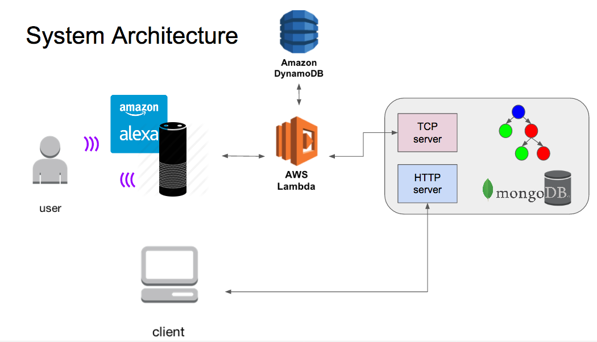
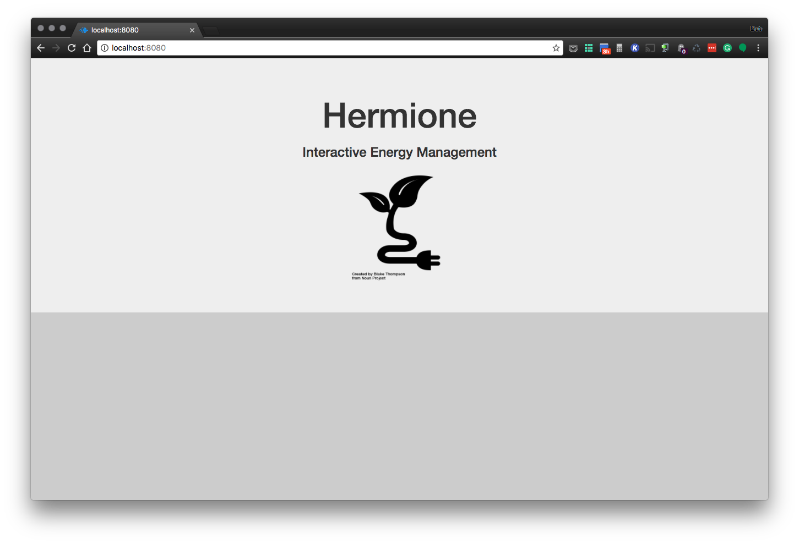
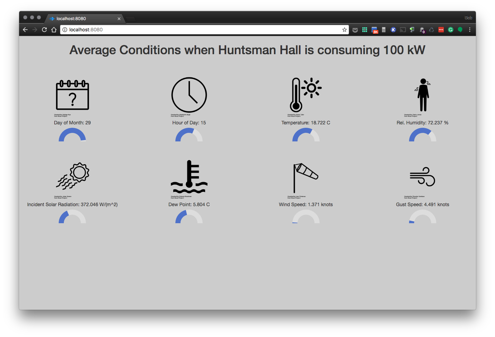
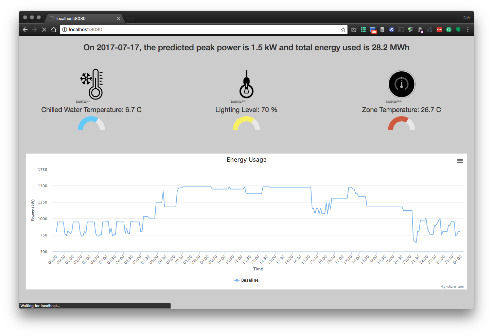
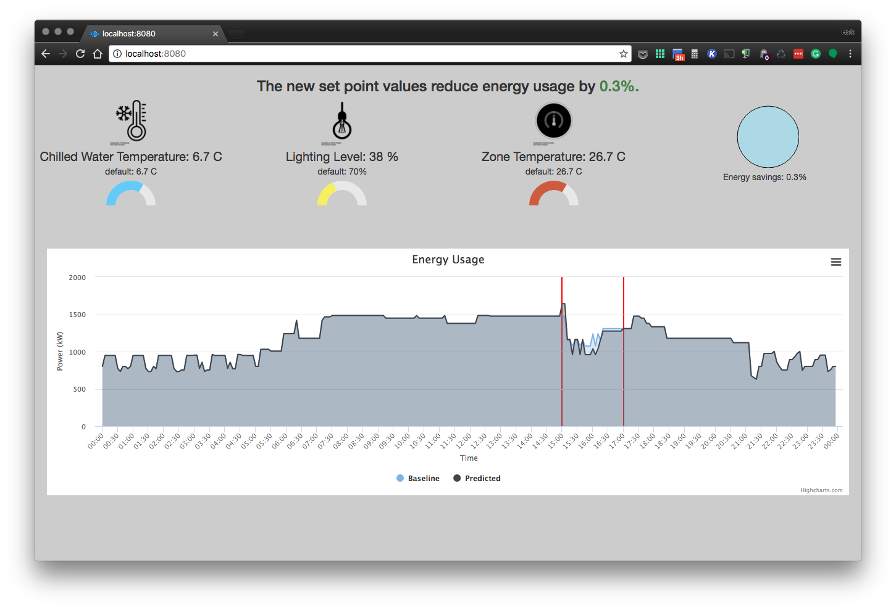
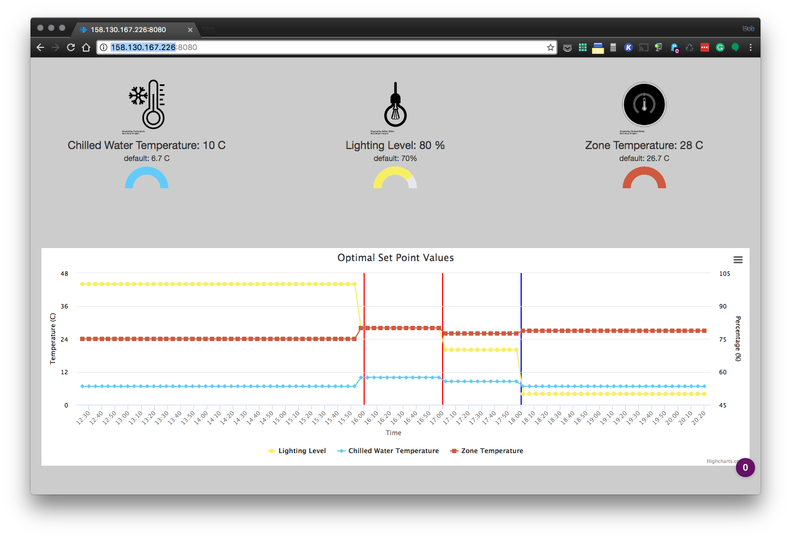

PROJECT NAME
============

**University of Pennsylvania, ESE 519: Real Time and Embedded Systems**

* TEAM MEMBERS
  * Prahalad Venkataramanan, prahalad@seas.upenn.edu
  * Karuna Ahuja, karunaa@seas.upenn.edu
  * Bob DiMaiolo, dimro@seas.upenn.edu
* [Blog](https://devpost.com/software/open-ended-energy-management) 

### DESCRIPTION AND GOALS
Our project aims to use Amazon Alexa as a platform for a more interactive and open-ended energy management system. Users will be able to verbally pose questions, which the system will categorize, request additional information if needed, and synthesize queries over trained machine learning data structures to generate a response. The verbal response will be supplemented with procedurally-generated graphics that help the user visualize different comparisons. 

#### Baseline Goals
1. Send requests from Alexa app on Amazon Echo to backend processing 
2. Update GUI based on query results with an appropriate graphical output in the user's browser
3. Respond to user’s question from Alexa with an appropriate verbal output from the Echo speaker

#### Reach Goals
1. Identify the category for a user’s question
2. Send response to user if additional information is needed to complete query
3. Procedurally generate graphical output based on the category of the user’s question

### VIDEO
View our demo video on [Youtube](https://www.youtube.com/watch?v=9K7-ZB2uEb0&feature=youtu.be) or on [DevPost](https://devpost.com/software/open-ended-energy-management)

### IMAGES

Landing Page

Building conditions

Prediction for July 17

Prediction for effects of set point changes

Suggested strategies

Optimal strategy

### BUILD INSTRUCTIONS

#### Alexa Skill
The Energy Advisor Alexa skill can be configured in the Amazon developer portal

1. Log in to the [Amazon developer portal](https://developer.amazon.com/)
2. In the top menu, select "ALEXA"
3. On the "Get started with Alexa" page, select "Alexa Skills Kit"
4. On the "Building Alexa Skills with the Alexa Skills Kit" page, select "Add a New Skill"
5. Complete the Skill Information section with the information from [alexa-skill/skill_info.txt](alexa-skill/skill_info.txt)
6. Complete the Interaction Model section with the information from [alexa-skill/interaction-model](alexa-skill/interaction-model)
7. In the Configuration, add the ARN of the AWS Lambda function created in the next section in the Endpoint field

#### AWS Lambda Function
The AWS Lambda function used to process requests generated by the Alexa skill can be configured in the [AWS console](https://aws.amazon.com/)

1. Install the [awscli tools](https://aws.amazon.com/cli/?sc_channel=PS&sc_campaign=acquisition_US&sc_publisher=google&sc_medium=command_line_b&sc_content=aws_cli_bmm&sc_detail=%2Baws%20%2Bcli&sc_category=command_line&sc_segment=159752350301&sc_matchtype=b&sc_country=US&s_kwcid=AL!4422!3!159752350301!b!!g!!%2Baws%20%2Bcli&ef_id=WEjP8gAAACGg3q8g:20161208031354:s)
2. In a terminal, run `aws configure`. Enter credentials and use region 'us-east-1'
3. Navigate to the [aws](aws) directory
4. Run `create-lambda-role.sh`
5. Copy the returned ARN for the role into [aws/deploy-lambda.sh](aws/deploy-lambda.sh)
6. Copy the Alexa skill ID from the Amazon developer portal, and the IP address of the web server into the Lambda function
6. Run `deploy-lambda.sh`
7. In the AWS console, navigate to the Lambda service. Add an Alexa Skills kit trigger.

#### Webserver
TODO: Steps to follow for anyone to use this code

#### Python Environment
1. The text file requirements.txt file in home folder contains all the packages required to set up the python environment
2. Install pip
 - sudo apt-get install python-pip
3. The following command installs the following:
   --pymongo==3.3.1
   --watchdog==0.8.3
   - pip install -r requirements.txt, 

#### MATLAB Environment
1. Please ensure that the Statistical Toolbox is installed in your MATLAB environment
2. To install EnergyPlus on Ubuntu, install and run the shell script from  https://github.com/NREL/EnergyPlusRelease/releases/tag/8.1.0.008
3. In MATLAB, navigate to ./MATLAB/MLE+/gui and run the following steps in your console
  - eplusPath = [ path to EnergyPlus installation on your local]
  - save eplusPath epluPath.mat
  - javaPath = [path to java installation on your local]
  - save javaPath javaPath.mat

#### MongoDB 
1. Enter “mongo” in terminal to enter mongo cli
2. Our db is energydata, enter “use energydata”
3. Our collections are the following, see all with “show collections”. query each collection with “db.[collection].find()”

- searchbin_results
 {
  "building": "HuntsmanHall",
  "bin": 1,
  "energyUsagekW": 10,
  "DayOfMonth": null,
  "TimeOfDay": null,
  "AvgTemperature": null,
  "AvgSolar": null,
  "AvgWindSpeed": null,
  "AvgGusts": null,
  "AvgHumidity": null,
  "AvgDewPoint": null
 }

- 'baseline_data'
 {
 "y_predict" : null,
 "time" : null
 }

- 'evaluator_data'
 {
  "y_predict": null,
  "time" : null,
  "day_flag" : True,
  "energy_saving" : 0,
  "cwsetp" : 0,
  "clgsetp" : 0,
  "lil" :0,
  "clgsetp": 0,
  "start_time" : 0,
  "end_time" : 0
  }

#### Node.js HTTP Server
TODO 
#### AWS DynamoDB
TODO: Steps to follow for anyone to use this code

### USE INSTRUCTIONS
1. To start TCP server
 - python tcp_server.py

2. To start web server
 - cd ./server_webserver
 - npm start

3. To access the dashboard 
 - http://[IP_of_web_server]:8080

