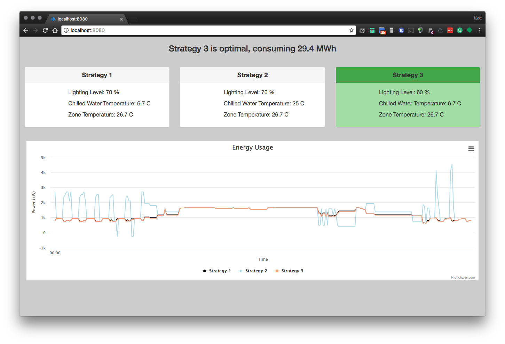

PROJECT NAME
============

**University of Pennsylvania, ESE 519: Real Time and Embedded Systems**

* TEAM MEMBERS
  * Prahalad Venkataramanan, prahalad@seas.upenn.edu
  * Karuna Ahuja, karunaa@seas.upenn.edu
  * Bob DiMaiolo, dimro@seas.upenn.edu
* [Blog](https://devpost.com/software/open-ended-energy-management) 

### DESCRIPTION AND GOALS
Our project aims to use Amazon Alexa as a platform for a more interactive and open-ended energy management system. Users will be able to verbally pose questions, which the system will categorize, request additional information if needed, and synthesize queries over trained machine learning data structures to generate a response. The verbal response will be supplemented with procedurally-generated graphics that help the user visualize different comparisons. 

#### Baseline Goals
1. Send requests from Alexa app on Amazon Echo to backend processing 
2. Update GUI based on query results with an appropriate graphical output in the user's browser
3. Respond to user’s question from Alexa with an appropriate verbal output from the Echo speaker

#### Reach Goals
1. Identify the category for a user’s question
2. Send response to user if additional information is needed to complete query
3. Procedurally generate graphical output based on the category of the user’s question

### VIDEO
View our demo video on [Youtube](https://www.youtube.com/watch?v=9K7-ZB2uEb0&feature=youtu.be) or on [DevPost](https://devpost.com/software/open-ended-energy-management)

### IMAGES

Landing Page

Building conditions

Prediction for July 17

Prediction for effects of set point changes

Suggested strategies

Optimal strategy

### BUILD INSTRUCTIONS

#### Alexa Skill
The Energy Advisor Alexa skill can be configured in the Amazon developer portal

1. Log in to the [Amazon developer portal](https://developer.amazon.com/)
2. In the top menu, select "ALEXA"
3. On the "Get started with Alexa" page, select "Alexa Skills Kit"
4. On the "Building Alexa Skills with the Alexa Skills Kit" page, select "Add a New Skill"
5. Complete the Skill Information section with the information from [alexa-skill/skill_info.txt](alexa-skill/skill_info.txt)
6. Complete the Interaction Model section with the information from [alexa-skill/interaction-model](alexa-skill/interaction-model)
7. In the Configuration, add the ARN of the AWS Lambda function created in the next section in the Endpoint field

#### AWS Lambda Function
The AWS Lambda function used to process requests generated by the Alexa skill can be configured in the [AWS console](https://aws.amazon.com/)

1. Install the [awscli tools](https://aws.amazon.com/cli/?sc_channel=PS&sc_campaign=acquisition_US&sc_publisher=google&sc_medium=command_line_b&sc_content=aws_cli_bmm&sc_detail=%2Baws%20%2Bcli&sc_category=command_line&sc_segment=159752350301&sc_matchtype=b&sc_country=US&s_kwcid=AL!4422!3!159752350301!b!!g!!%2Baws%20%2Bcli&ef_id=WEjP8gAAACGg3q8g:20161208031354:s)
2. In a terminal, run `aws configure`. Enter credentials and use region 'us-east-1'
3. Navigate to the [aws](aws) directory
4. Run `create-lambda-role.sh`
5. Copy the returned ARN for the role into [aws/deploy-lambda.sh](aws/deploy-lambda.sh)
6. Copy the Alexa skill ID from the Amazon developer portal, and the IP address of the web server into the Lambda function
6. Run `deploy-lambda.sh`
7. In the AWS console, navigate to the Lambda service. Add an Alexa Skills kit trigger.

#### Webserver
The nodejs web server resides in "server-nodejs" folder and is responsible for reading and updating the front-end on the client. It uses express MVC framework wherein the webpages that are displayed reside in server-nodejs/views folder and the routes reside in server-nodejs/routes folder. "server-nodejs/bin/www" starts the server by running server-nodejs/app.js. Note that the web server serves requests arriving on port 8080.
Make sure you have npm package manager for JavaScript.

1. To start the HTTP web server, navigate to server-nodejs and execute the command "npm start". Note that the web server has to run on the same machine which runs the tcp server and houses the MongoDB data.
2. On successful start of the web server, the terminal should display the port on which it is listening.
3. Make a note of the IP address of the machine.
4. Open the browser (Eg, Microsoft Edge, Google Chrome, etc) on any machine and open the URL : "{IP address}:8080/". Eg: 150.150.75.75:8080/ or localhost:8080/

#### Python Environment
1. The text file requirements.txt file in home folder contains all the packages required to set up the python environment
2. Install pip
 - sudo apt-get install python-pip
3. The following command installs the following:
   --pymongo==3.3.1
   --watchdog==0.8.3
   - pip install -r requirements.txt, 

#### MATLAB Environment
1. Please ensure that the Statistical Toolbox is installed in your MATLAB environment
2. To install EnergyPlus on Ubuntu, install and run the shell script from  https://github.com/NREL/EnergyPlusRelease/releases/tag/8.1.0.008
3. In MATLAB, navigate to ./MATLAB/MLE+/gui and run the following steps in your console
  - eplusPath = [ path to EnergyPlus installation on your local]
  - save eplusPath epluPath.mat
  - javaPath = [path to java installation on your local]
  - save javaPath javaPath.mat

#### MongoDB 
1. Enter “mongo” in terminal to enter mongo cli
2. Our db is energydata, enter “use energydata”
3. Our collections are the following, see all with “show collections”. query each collection with “db.[collection].find()”

- searchbin_results
 {
  "building": "HuntsmanHall",
  "bin": 1,
  "energyUsagekW": 10,
  "DayOfMonth": null,
  "TimeOfDay": null,
  "AvgTemperature": null,
  "AvgSolar": null,
  "AvgWindSpeed": null,
  "AvgGusts": null,
  "AvgHumidity": null,
  "AvgDewPoint": null
 }

- 'baseline_data'
 {
 "y_predict" : null,
 "time" : null
 }

- 'evaluator_data'
 {
  "y_predict": null,
  "time" : null,
  "day_flag" : True,
  "energy_saving" : 0,
  "cwsetp" : 0,
  "clgsetp" : 0,
  "lil" :0,
  "clgsetp": 0,
  "start_time" : 0,
  "end_time" : 0
  }

#### AWS DynamoDB
For conversational queries, the lambda function has to store the partial information that it receives from the user until it has all the information necessary for further processing. Since it is stateless, lambda uses DynamoDB to preserve its state. Note that the Dynamo DB has to be present and running in the same account and same region as that of your lambda.
For this project, we use the following four tables:

1. searchbin{id (string), building (string), wattage (string)} - Table to store the bulding name or the wattage specified.
2. prev_num_setp{id (number), num_setp (number)} - Table to store the number of setpoints the user mentioned in the conversation before specifying time.
3. evaluator_two_setpoints{id (string), setpoint_type1 (string), setpoint_val1 (string), setpoint_type2 (string), setpoint_val2 (string)} - Table to store the setpoints specified in the conversation.
4. evaluator_one_setpoint{id (string), setpoint_type (string), setpoint_val (string)} - Table to store the setpoint specified in the conversation in case of evaluaton of one setpoint change.

Steps to create a table:

1. Log in to your aws account and navigate to DynamoDB service (from the list of services available to you). Click on the option "create table".
2. Enter the table name and mention "id" as the primary key. Specify the type of the id (from the dropdown) as mentioned above.
3. Retain default settings (leave it checked)
4. Click on "Create".
5. Once the table is created, you see the options: Overview, Items, Metrics, Alarms, etc. Navigate to Items and click on "Create Item".
6. A pop-up windows opens up allowing you to add fields. Enter the fields as mentioned above and click on save. make sure the initial values are Null in case of string fields.

Repeat the above steps for each table and make sure all the four tables are present in the DynamoDB so that the lambda function can store its state.

### USE INSTRUCTIONS
1. To start TCP server
 - python tcp_server.py

2. To start web server
 - cd ./server-nodejs
 - npm start

3. To access the dashboard 
 - http://[IP_of_web_server]:8080

